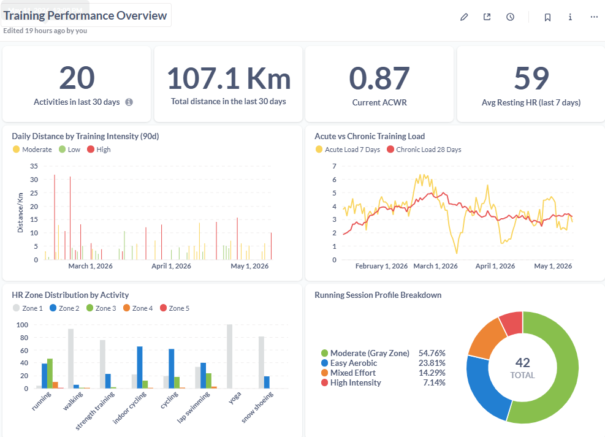
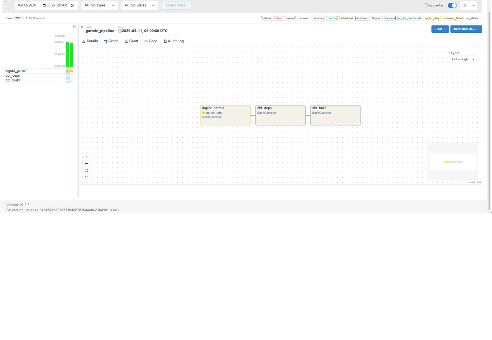

# Garmin Training Analytics

End-to-end analytics pipeline built on personal Garmin Connect data. Demonstrates a modern data stack: Python ingestion → Postgres warehouse → dbt transformations → Metabase dashboard, orchestrated with Apache Airflow.

Built as a portfolio project to apply analytics engineering patterns (incremental models, source freshness, testing, modular SQL) to real, messy, time-series biometric data.

## Dashboard




## Orchestration



## Stack

| Layer | Tool |
|---|---|
| Ingestion | Python + `garminconnect` library |
| Warehouse | PostgreSQL 16 |
| Transformation | dbt Core 1.8 |
| Visualization | Metabase |
| Orchestration | Apache Airflow 2.9 |
| Infrastructure | Docker Compose |

## Architecture

```
Garmin Connect API
        │
        ▼
  Python ingest script  ──►  raw.activities (JSONB)
                             raw.daily_stats (JSONB)
                                    │
                                    ▼
                            dbt staging models
                            (parse JSONB → typed columns,
                             incremental materialization)
                                    │
                                    ▼
                              dbt mart models
                            (daily training facts,
                             weekly load with ACWR,
                             HR zone analysis)
                                    │
                                    ▼
                            Metabase dashboard

  All orchestrated daily by an Airflow DAG.
```

## dbt models

**Staging** (`models/staging/`)
- `stg_activities` — parses raw JSONB activity payloads into typed columns. **Incremental** materialization (only processes rows loaded since last run).
- `stg_daily_stats` — parses daily summary payloads.

**Marts** (`models/marts/`)
- `fct_daily_training` — one row per day. Combines workout activities with overall daily physiology. Adds derived flags (`had_workout`, `training_intensity`).
- `fct_weekly_training_load` — rolling acute (7d) vs chronic (28d) training load with ACWR scoring (`undertraining`, `sweet_spot`, `elevated`, `injury_risk`).
- `fct_hr_zones` — per-activity heart-rate zone breakdown, with time-in-zone, percentages, and a session-profile classification (`polarized_easy`, `gray_zone`, `high_intensity`, `mixed`).

## Data quality

All models are covered by dbt tests:
- Uniqueness and not-null on primary keys
- Accepted-values tests on categorical columns
- Source-level tests on raw tables

## Sample insight

Running session breakdown (42 sessions, 5 months of data):

| Profile | Sessions | % |
|---|---|---|
| Gray Zone (Moderate) | 23 | 54.8% |
| Easy Aerobic (Polarized) | 10 | 23.8% |
| Mixed Effort | 6 | 14.3% |
| High Intensity | 3 | 7.1% |

The 80/20 rule used by elite endurance athletes targets ~80% easy / ~20% hard, with minimal moderate training. This pipeline surfaced that 55% of running sessions sit in the unproductive "gray zone" — driving a real change in training plan.

## Local setup

```bash
# 1. Clone
git clone https://github.com/your-username/garmin-analytics.git
cd garmin-analytics

# 2. Configure credentials
cp .env.example .env
# Edit .env with your Garmin email/password

# 3. Start the stack
docker compose up -d

# 4. Initial data load
python -m venv venv
venv\Scripts\activate    # Windows
pip install -r requirements.txt
python ingest_garmin.py

# 5. Build dbt models
cd garmin_dbt
dbt build

# 6. Access services
# Metabase:  http://localhost:3000
# Airflow:   http://localhost:8080
# Postgres:  localhost:5433
```

## What this project demonstrates

- End-to-end ownership of a data pipeline (ingestion → warehouse → transformation → visualization → orchestration)
- Production-grade dbt patterns: incremental models, source freshness, modular SQL, tests, documentation
- Window functions and rolling aggregates for time-series analytics
- Domain modeling (acute:chronic ratio, HR zones) from raw IoT-style biometric data
- Infrastructure as code via Docker Compose

## Author

George Abou Jaoude — Senior Analytics Engineer
[LinkedIn](https://linkedin.com/in/george-abou-jaoude)